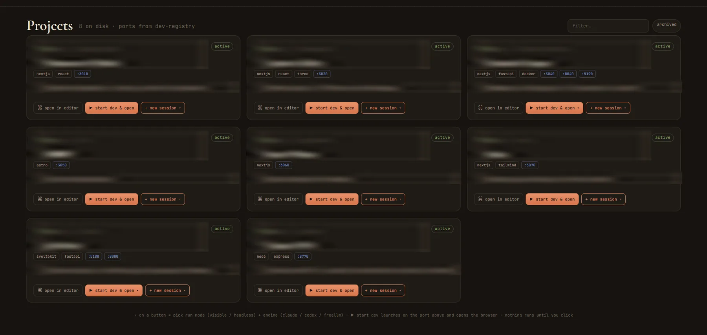

# Agentic OS 2.0

Agentic OS 2.0 is a local-first workflow cockpit built with Electron, React, and TypeScript.
It gives one desktop window for:

- a morning briefing from markdown handoff notes
- a fixed-port local project launcher
- a read-only markdown vault browser
- a video-curator surface for notes produced by your own pipeline



This public version is sanitized and configurable. It does not include private notes, project
names, logs, local paths, credentials, build output, or personal workflow history.

## Tech stack

- Electron, React, TypeScript
- Node.js 22+, pnpm

## Prerequisites

- Node.js 22 or newer
- pnpm
- Windows Terminal (`wt.exe`) for visible session/project launches on Windows
- Optional local CLIs: `claude`, `codex`, and a FreeLLMAPI-compatible helper if you enable those actions

## Install

```bash
pnpm install
```

## Development

```bash
pnpm dev
```

The Electron app launches a local desktop window. Visible terminal actions are intended for
a trusted local machine; do not expose the app over a network or tunnel.

## Configure

By default the app reads from `~/AgenticOS`. Override paths with environment variables:

```bash
AGENTIC_ROOT=C:\path\to\your\workspace
AGENTIC_VAULT=C:\path\to\your\workspace\vault
AGENTIC_ARCHIVE_VAULT=C:\path\to\your\workspace\archive-vault
AGENTIC_FABLES_DIR=C:\path\to\your\workspace\sample-data\daily-fables
AGENTIC_CURATOR_ARCHIVE_DIR=C:\path\to\your\workspace\sample-data\video-curator
AGENTIC_CURATOR_LIVE_DIR=C:\path\to\your\workspace\briefing\curator
AGENTIC_PROJECTS_DIR=C:\path\to\your\workspace\projects
AGENTIC_APP_DIR=C:\path\to\your\workspace\projects\agentic-os-2
AGENTIC_SELF_UPDATE_SCRIPT=C:\path\to\your\workspace\projects\agentic-os-2\scripts\self-update.ps1
AGENTIC_BRIEFING_WATERMARK=C:\path\to\your\workspace\briefing\last-briefing.json
AGENTIC_IMPORT_SOURCES=C:\path\to\your\workspace\briefing\import-sources.json
AGENTIC_IMPORT_STATE=C:\path\to\your\workspace\briefing\import-state.json
AGENTIC_CURATOR_FEEDBACK_DIR=C:\path\to\your\workspace\briefing\curator-feedback
AGENTIC_CURATOR_SESSION_DIR=C:\path\to\your\workspace\briefing\curator-sessions
AGENTIC_CURATOR_LEARNINGS=C:\path\to\your\workspace\vault\Mechanics\video-curator\learnings.md
EDITOR_EXE=C:\path\to\your\editor.exe
CLAUDE_CMD=claude
CODEX_CMD=codex
FREELLM_CMD=C:\path\to\freellmapi-chat.ps1
VIDEO_CURATOR_SCRIPT=C:\path\to\curate.py
VIDEO_IMPORT_SCRIPT=C:\path\to\import_saved.py
```

The sample project catalog lives in `src/main/lib/projects.ts`. Replace those entries with
your own local projects and ports.

The app reads process environment variables. It does not auto-load `.env`; `.env.example`
is provided as a checklist for launch scripts, shells, or your own dotenv wrapper.

## Verify

```bash
pnpm typecheck
pnpm build
```

## License

MIT — see [LICENSE](LICENSE).
